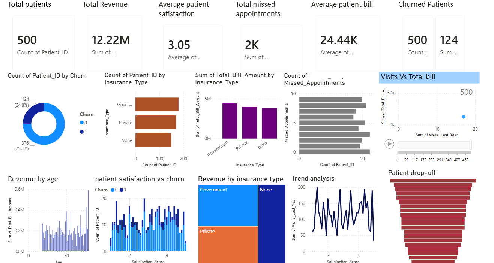

Tools Used
• Power BI
• Data Visualization
• Healthcare Data Analysis

Key Insights

• A portion of patients show churn behavior indicating potential retention issues.
• Patients with more missed appointments tend to churn more frequently.
• Certain insurance types generate higher medical revenue.
• Higher satisfaction scores correlate with better patient retention.
• Older patients generally contribute higher healthcare spending.

Dataset

Healthcare patient dataset containing patient demographics, insurance information, satisfaction scores, visit history, and billing amounts.

